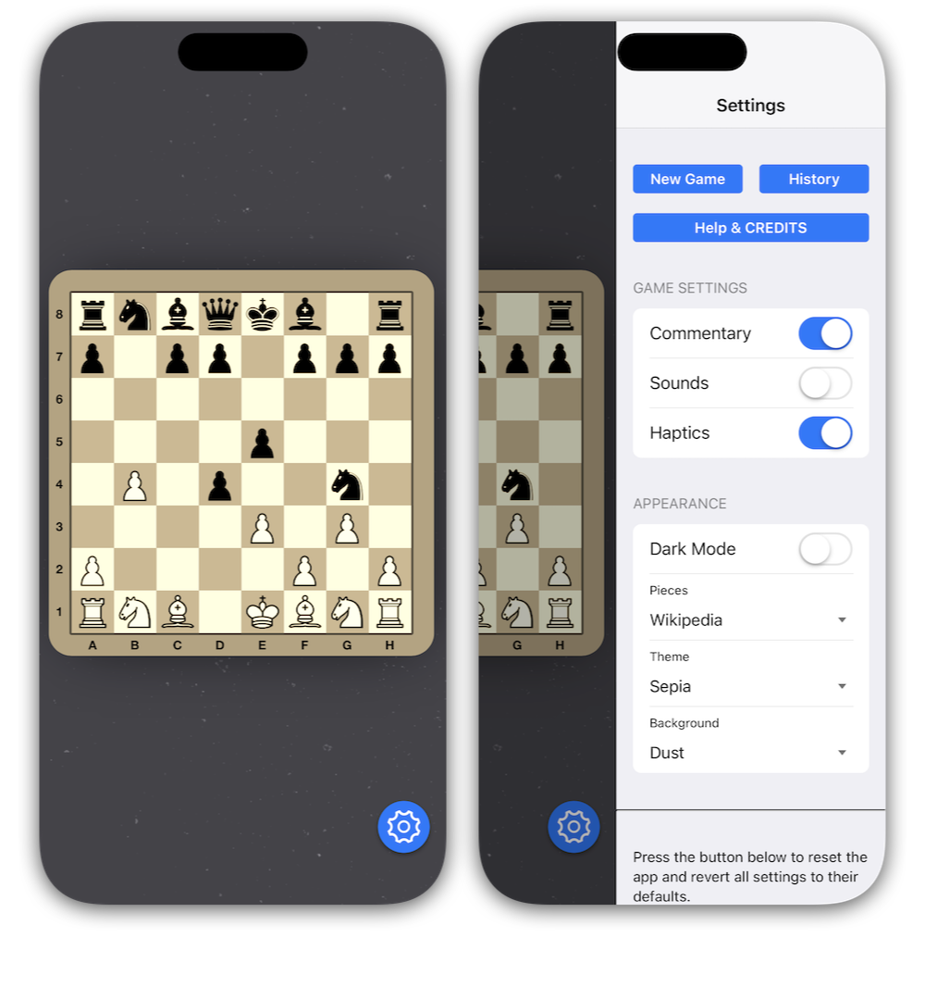

# TV Chess - Basic

This sample project demonstrates the versatility and power of the [enClose](http://github.com/fellowgeek/enClose) framework for building hybrid iOS applications using web technologies while accessing native device capabilities.

TV Chess is a two-player chess application that showcases seamless integration between web-based UI components and native iOS features. The project illustrates how developers can leverage familiar web technologies while still delivering a truly native experience with platform-specific functionality.

## Technical Highlights

- **Framework Integration**: Built with Framework7 and enClose, demonstrating smooth bidirectional communication between JavaScript and native code
- **Chess Engine**: Utilizes chess.js for game logic and chessboard.js for the interactive chess interface
- **Native Feature Access**:
  - Text-to-speech for humorous game commentary
  - Device haptic feedback for tactile response
  - Sound playback for enhanced user experience
  - Local data persistence within the app's document directory
  - iOS share sheet integration for sharing game PGN history

## Developer Learning Opportunities

- Implementation of external display support (mirroring or via HDMI dongle)
- User preference management for themes, backgrounds, and interaction options
- Data export functionality (PGN history) demonstrating content sharing capabilities
- Modular architecture showcasing proper separation of web and native components

This sample serves as a comprehensive reference for enClose developers looking to build feature-rich applications that combine the development efficiency of web technologies with the performance and capability advantages of native iOS features.
